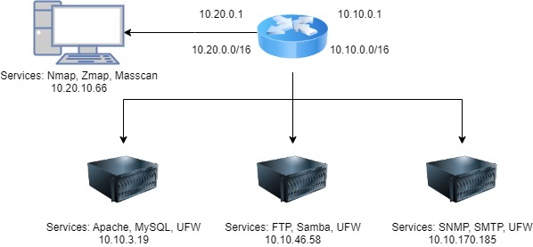

# FIIT BIT 2024  
## Vulnerability Assessment in Large Networks Using Various Scanning Tools

All machines share the same private network (/16).

### Quick Start

```bash
vagrant up -vvvv
vagrant suspend
vagrant resume
```

### Kali
The attacker comes with nmap, zmap, masscan, and my own implementation of go-nscan preinstalled.
```
Username: vagrant  
Password: vagrant  
```

### OpenVAS Setup
To run OpenVAS, increase `vb.memory` in Vagrantfile and set `/host_vars/kali.yml` `include_openvas: true`.

```bash
docker run -d -p 443:443 --name openvas mikesplain/openvas
```

