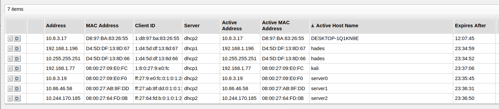
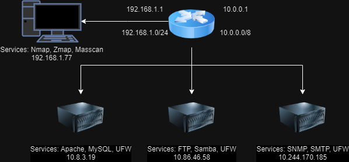

# FIIT BIT 2024  
## Vulnerability Assessment in Large Networks Using Various Scanning Tools

All machines share the same home network (/8). They have static ips set up on home router based on their mac addresses.



### Quick Start With [`./renew.sh`](./renew.sh)

```bash
vagrant up -vvvv
vagrant suspend
vagrant resume
vagrant destroy
```

### Kali
The attacker comes with nmap, zmap, masscan, and my own implementation of scanner [`/opt/nscan`](./go-nscan/README.md) preinstalled.
```
Username: kali  
Password: kali  
```

### Tools Tested Using [`/opt/test.sh`](./provisioning/roles/kali/files/test.sh)
First check connectivity
```bash
ips=(10.255.255.251 10.244.170.185 10.86.46.58 10.8.3.19 10.8.3.17 10.0.0.1); for ip in "${ips[@]}"; do ping -c 1 "$ip" > /dev/null && echo "$ip is reachable" || echo "$ip is unreachable"; done
```
Results can be shown [here](./data-processing/processed_data.ipynb).
```bash
/opt/test.sh 
```

### WeMap 
To access get token, and navigate to browser. Store scan output xml files in `/tmp/webmap`. Example [`/opt/pipeline.sh`](./provisioning/roles/kali/files/pipeline.sh).
```bash
docker run -d \
         --name webmap \
         -h webmap \
         -p 8000:8000 \
         -v /tmp/webmap:/opt/xml \
         reborntc/webmap
docker exec -ti webmap /root/token
localhost:8000
```

### OpenVAS
To run OpenVAS preferably increase `vb.memory` in Vagrantfile and set `/host_vars/kali.yml` `include_openvas: true`. This dockerized version is outdated, and serves only as a showcase of what is OpenVas capable of.

```bash
docker run -d -p 443:443 -e OV_PASSWORD=admin --name openvas mikesplain/openvas
docker logs -f openvas
https://localhost:443
Username: admin
Password: admin
```

